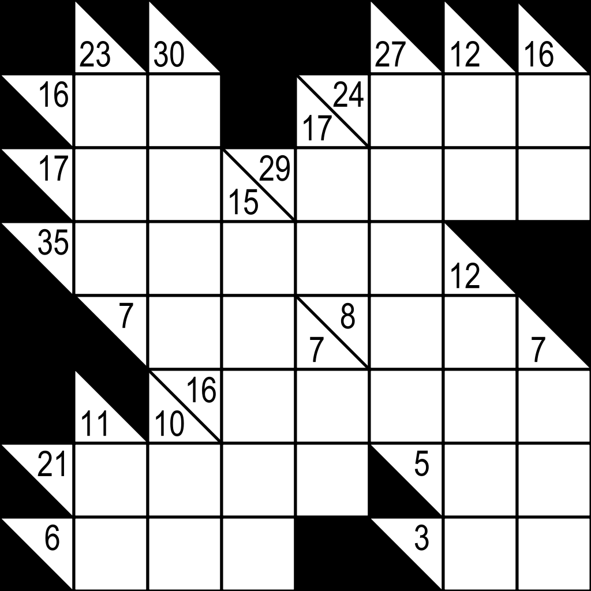
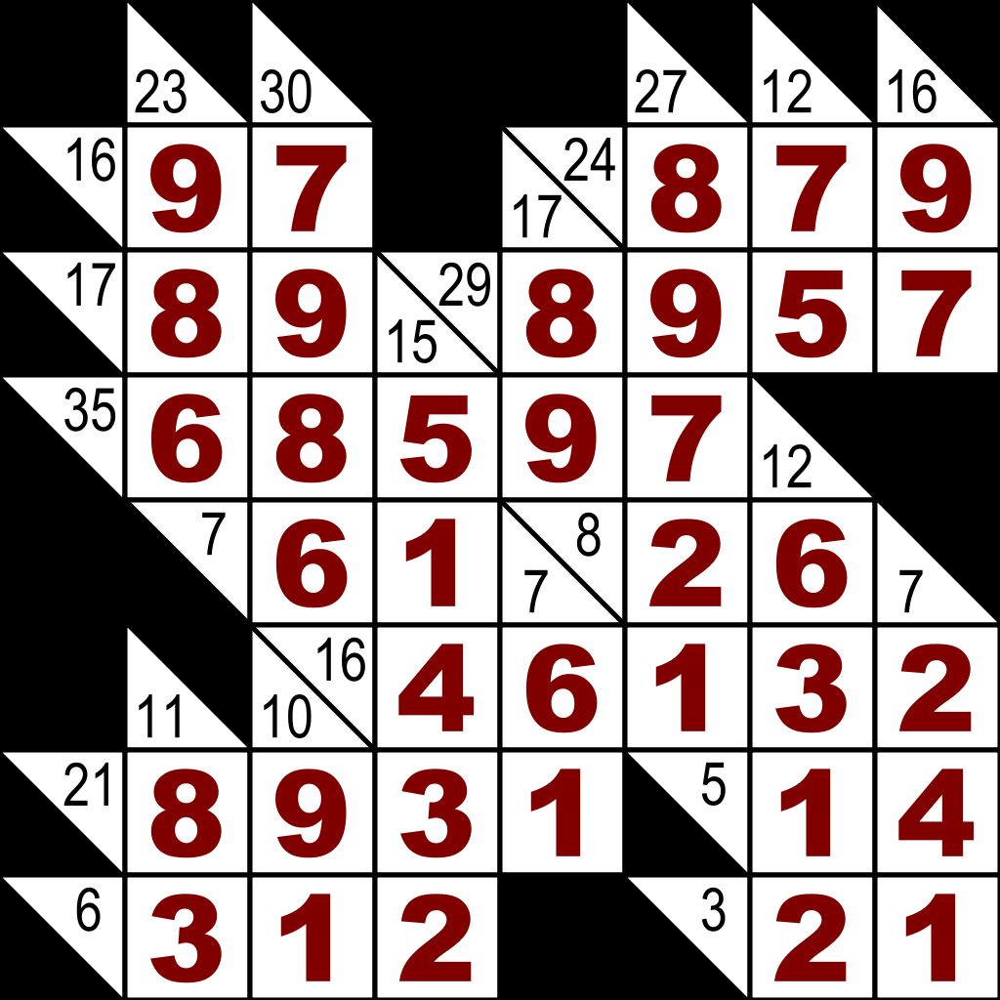

# Kakuro

This is my final project for 
[CMSC388F: Functional Pearls](http://www.cs.umd.edu/class/spring2019/cmsc388F/) 
at the University of Maryland. This class was mostly taught in Haskell and 
included some interesting topics within functional programming.

We were tasked with coming up with some sort of project idea which we would
present at the end of the year. Inspired by the example of a Sudoku solver shown
to us at the beginning of the year, I decided to create a solver for a
different Japanese puzzle game.

## The game

Kakuro is played on a square grid. The top and left sides are blacked out and
strewn throughout the board are more blacked out cells. Blacked out cells above
or to the left of an open cell contain a numeric constraint for all the cells
in that row/column. An example board can be seen below.

The game is played by placing numbers on the board and the rules are pretty
simple:

* The numbers in every row/column must add up to the numeric constraint
for that row/column
* No duplicate numbers in a single row/column

### Example Board
From [Wikipedia](https://en.wikipedia.org/wiki/Kakuro)

Solution to the previous board

## Our Solver

I decided to base our solver on the sudoku solver given to us in class
(included in this repository) because the two games are very similar.

First I defined the types I would need for our solver. I used one type to
represent the grid and another type to represent the constraints. From there I
implemented some simple test cases to keep the code grounded as I went and got
to coding.

I do a few passes of the board first laying out all possible values in every
cell which is of course super slow. Then I implemented some trimming of the
search space by pruning numbers that cannot possibly add up to the
constraint based on the length of and current values in the row/column. Then I
implemented fixed point iteration to go along with this so that we could get
the most out of this pruning. This is still unfortunately too slow.

The third and final pass is kind of a depth first search where we lock down one
value on the board and then update the available values in the other cells
recursively until we reach a conflict where there are no possible values for a
cell. This approach ended up being acceptably fast and could solve a 10x12
puzzle in about a second.

I learned a lot about Haskell and functional programming in general from this
project and hope to be able to use Haskell in some capacity later. I think the
concepts taught in this course were intriguing and more people should be exposed
to them in their computer science careers. The code is a bit of a mess right
now but one day I'll come back and clean it up.
